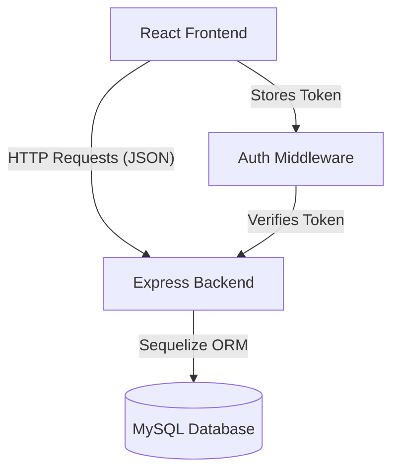

<div align="center">

# Store Rating Application

### Full-Stack Role-Based Rating Platform

[](https://reactjs.org/)
[](https://vitejs.dev/)
[](https://nodejs.org/)
[](https://expressjs.com/)
[](https://www.mysql.com/)
[](https://getbootstrap.com/)

**[Live Demo](https://store-app-frontend-ie2c.onrender.com)**


*A robust platform connecting Users, Store Owners, and Administrators through a transparent rating ecosystem.*

</div>

---

## Table of Contents

- [Overview](#overview)
- [Features](#features)
- [Tech Stack](#tech-stack)
- [Architecture](#architecture)
- [Installation & Setup](#installation--setup)
- [Usage](#usage)
- [API Documentation](#api-documentation)
- [Project Structure](#project-structure)
- [License](#license)
- [Contact](#contact)

---

## Overview

The **Store Rating Application** is a comprehensive full-stack web solution designed to facilitate transparent feedback between customers and businesses. It features a secure, **Role-Based Access Control (RBAC)** system that serves three distinct user types: **System Administrators**, **Store Owners**, and **Normal Users**.

The platform allows users to search for stores and submit 1-5 star ratings, while providing store owners with real-time analytics on their performance. Administrators maintain full control over the system, managing users and stores through a dedicated dashboard.

---

## Features

### 🛡️ Authentication & Security
* **Secure Login/Signup:** JWT-based authentication with session management.
* **Strict Validation:** Password complexity enforcement (8-16 chars, 1 Upper, 1 Special) and Name validation (20-60 chars).
* **Password Management:** Secure password hashing (Bcrypt) and "Change Password" functionality with auto-logout.

### 👤 User Roles & Capabilities

| Role | Capabilities |
| :--- | :--- |
| **System Admin** | • View Global Stats (Total Users, Stores, Ratings)<br>• Manage Users (View, Filter, Add, Sort)<br>• Manage Stores (Create, View, Sort)<br>• Create Store Owner accounts linked to stores |
| **Store Owner** | • Access dedicated Dashboard<br>• View Real-time Average Rating<br>• View list of customers who rated their store |
| **Normal User** | • Browse & Search Stores (by Name/Address)<br>• Sort Stores (Highest Rated, Lowest Rated)<br>• Submit, Modify, and Clear Ratings |

### 📊 Dashboard & UI
* **Interactive Dashboards:** Role-specific views upon login.
* **Visual Rating System:** Interactive star components for rating submission.
* **Sorting & Filtering:** Advanced filtering for User lists and Store lists.
* **Responsive Design:** Fully responsive UI built with Bootstrap 5.

---

## Tech Stack

### Frontend
* **Framework:** React.js (Vite)
* **Styling:** Bootstrap 5, FontAwesome Icons
* **State Management:** React Context API
* **Form Handling:** Formik + Yup Validation
* **HTTP Client:** Axios (with Interceptors)

### Backend
* **Runtime:** Node.js
* **Framework:** Express.js
* **ORM:** Sequelize
* **Authentication:** JSON Web Tokens (JWT), Bcrypt.js

### Database
* **Database:** MySQL
* **Hosting (Prod):** Aiven (DB) + Render (App)

---

## Architecture




---

## Installation & Setup

Follow these steps to run the project locally.

### Prerequisites

* Node.js (v14+)
* MySQL Server (Running locally or via cloud)

### 1. Clone the Repository

```bash
git clone https://github.com/SreejitBakshi10/store-rating-app.git
cd store-rating-app

```

### 2. Backend Setup

Navigate to the server directory and install dependencies.

```bash
cd server
npm install

```

Create a `.env` file in the `server/` directory:

```env
PORT=5000
DB_HOST=localhost
DB_PORT=3306
DB_USER=root
DB_PASS=your_password
DB_NAME=store_rating_db
JWT_SECRET=your_super_secret_key

```

Seed the database (Creates tables & Admin user):

```bash
node seedAdmin.js

```

Start the server:

```bash
npm run dev

```

### 3. Frontend Setup

Open a new terminal, navigate to the client directory, and install dependencies.

```bash
cd ../client
npm install

```

Start the React development server:

```bash
npm run dev

```

Visit `http://localhost:5173` in your browser.

---

## Usage

### Default Administrator Login

Use these credentials to log in for the first time:

* **Email:** `admin@store.com`
* **Password:** `AdminPassword1!`

### How to Test Role Logic

1. **Log in as Admin:**
* Go to "Add Store" and create a store (e.g., "Pizza Hut", Email: `manager@pizza.com`).
* Go to "Add User" and create a Store Owner user with email `manager@pizza.com`.


2. **Log in as User:**
* Sign up as a new user (Name > 20 chars).
* Find "Pizza Hut" on the dashboard and give it 5 stars.


3. **Log in as Owner:**
* Log in with `manager@pizza.com`.
* See the dashboard showing 5.0 Average Rating and the user's details.


---

## API Documentation

| Method | Endpoint | Description | Auth Required |
| --- | --- | --- | --- |
| **Auth** |  |  |  |
| `POST` | `/api/auth/login` | Authenticate user & get Token | No |
| `POST` | `/api/auth/register` | Register a new Normal User | No |
| `PUT` | `/api/auth/password` | Change current password | Yes |
| **Stores** |  |  |  |
| `GET` | `/api/stores` | Get all stores (with filters) | Yes |
| `POST` | `/api/stores` | Create a new store | Admin Only |
| `POST` | `/api/stores/:id/rate` | Rate a store | User Only |
| `DELETE` | `/api/stores/:id/rate` | Remove rating | User Only |
| `GET` | `/api/stores/my-dashboard` | Get Owner stats | Owner Only |
| **Users** |  |  |  |
| `GET` | `/api/users` | Get all users (with filters) | Admin Only |
| `POST` | `/api/users` | Create a new user (any role) | Admin Only |

---

## Project Structure

```bash
store-rating-app
├── client                                 # Frontend (React + Vite)
│   ├── public
│   │   └── logo.png
│   ├── src
│   │   ├── api                            # Axios configuration
│   │   │   └── axios.js
│   │   ├── components                     # Reusable UI (Navbar, Cards, Modals)
│   │   │   ├── AddStoreForm.jsx
│   │   │   ├── BootstrapModal.jsx
│   │   │   ├── ChangePasswordModal.jsx
│   │   │   ├── Navbar.jsx
│   │   │   └── StoreCard.jsx
│   │   ├── context                        # Auth Context (Global State)
│   │   │   └── AuthContext.jsx
│   │   ├── pages                          # Login, Signup, Dashboard Wrapper
│   │   │   ├── dashboards                 # Role-specific Dashboard Views
│   │   │   │   ├── AdminDashboard.jsx
│   │   │   │   ├── OwnerDashboard.jsx
│   │   │   │   └── UserDashboard.jsx 
│   │   │   ├── Dashboard.jsx
│   │   │   ├── Login.jsx
│   │   │   └── Signup.jsx
│   │   ├── App.jsx                        # Main Route Definitions
│   │   └── main.jsx                       # Entry Point
│   ├── .gitignore
│   ├── eslint.config.js
│   ├── index.html
│   ├── package-lock.json
│   ├── package.json
│   └── vite.config.js
│
│
├── server                                 # Backend (Node + Express)
│   ├── config                             # Database Connection
│   │   └── db.js
│   ├── controllers                        # Business Logic (Auth, Stores, Users)
│   │   ├── authController.js
│   │   ├── storeController.js
│   │   └── userController.js
│   ├── middleware                         # Auth & RBAC Middleware
│   │   └── authMiddleware.js
│   ├── models                             # Sequelize Models (User, Store, Rating)
│   │   ├── index.js
│   │   ├── Rating.js
│   │   ├── Store.js
│   │   └── User.js
│   ├── routes                             # API Endpoint Definitions
│   │   ├── authRoutes.js
│   │   ├── storeRoutes.js
│   │   └── userRoutes.js
│   ├── package-lock.json
│   ├── package.json
│   ├── seedAdmin.js                       # DB Seeder Script
│   └── server.js                          # App Entry Point
├── .gitignore                             # Git ignore rules
├── README.md                              # This file
└── License                                # MIT License    

```

---

## License

This project is licensed under the **MIT License** - see the [LICENSE](LICENSE) file for details.

---

## Contact

**Sreejit Bakshi**

[](https://github.com/SreejitBakshi10)
[](https://www.linkedin.com/in/sreejit-bakshi-156133324)

**Project Link**: [https://github.com/SreejitBakshi10/store-rating-app](https://github.com/SreejitBakshi10/store-rating-app)

**Live Demo**: [https://store-app-frontend-ie2c.onrender.com](https://store-app-frontend-ie2c.onrender.com)
